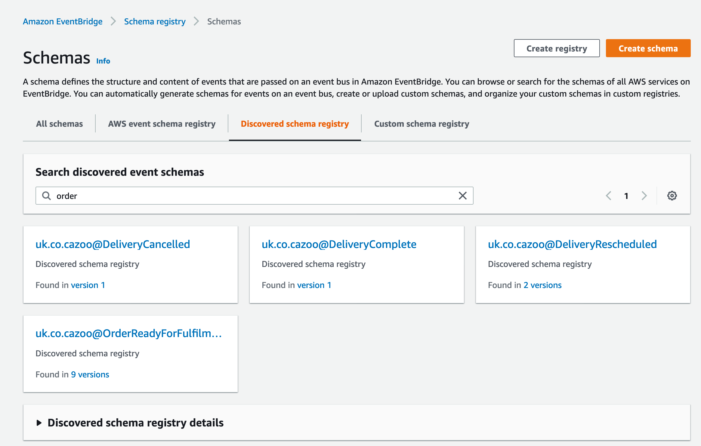

layout: true
class: typo, typo-selection
count: false

---

# Seventeen Ways to Use EventBridge as Reactive Event Driven Serverless Message Bus for Distributed Cloud-Native DDD Enterprise Microservice Architectures on Lambda with Typescript And NodeJS And Lose Weight Fast With This One Weird Trick Software Consultants Hate Him You Won't Believe Number Nine!


???

The trouble with talk titles is that once you start adding search engine keywords, it's hard to know where to stop.

---
class: p-0,m-0,vcenter

.card.book.noborder.noround.m-0.width-96.relative-layout.left-2[
  .img[]
  .section.pl-l.pr-xxl.pt-xxl[
  .font-xxxl[WHO AM I?]
  .mt-xxxl[
* Software architect and craftsman
* @Bob_the_mighty on Twitter
* Slides https://github.com/bobthemighty/talk-eventbridge-is-so-hot
    ]
  ]
]

---

# Seventeen Ways to Use EventBridge as Reactive Event Driven Serverless Message Bus for Distributed Cloud-Native DDD Enterprise Microservice Architectures on Lambda with Typescript And NodeJS And Lose Weight Fast With This One Weird Trick Software Consultants Hate Him You Won't Believe Number Nine!

Or _Why EventBridge Is So Hot Right Now_.

???

I want to talk this evening about EventBridge, which is a technology from Amazon, that I think is the most exciting serverless technology since Lambda, because it provides a simple tool that answers a wide range of use cases, particularly with respect to sensible system design.

---

# Services and Boundaries

## The .strike[four] three tenets of SOA

* Bounaries Are Explicit
* Services Are Autonomous
* Services Share Schema, Not Class

???

I have an unpopular opinion which is that "micro-services" is a terrible, harmful term. It's harmful because it's been widely misunderstood and people have blunderingly applied their misapprehensions to projects that suffer as a result. We're now seeing this kind of backlash against microservices as a capital T Thing, because there's so much scope for making a big mess of everything and ruining your productivity.
Instead, I think we need to get back to talking about service oriented architecture, and message-passing as a primary means of integration systems. These aren't new ideas, they pre-date microservices by about a decade, and were captured in the original tenets of SOA, publihed by Microsoft back when SOAP was cool.

---

# Services and Boundaries

## Boundaries are Explicit

* Services communicate through .serif[published contracts]
* This might be .serif[synchronous], eg HTTP, or asynchronous via .serif[message passing]
* We should be able to .serif[replace] a service completely so long as we respect the .serif[contract]
* Services should be .serif[opaque]: consumers should be unaware of implementation details.

???

The first of the four tenets is Boundaries are Explicit. What we mean here is that the way we talk _inside_ a service is not the same as the way that we talk _between_ services. To make that happen, serviecs have to publish some kind of contract. That might be an API that we've documented with Swagger, or it could be a set of events and commands expressed in JSON schema. The contract represents some piece of functionality that we need elsewhere in our business.
It's important to note that implementation details are hidden behind the contract. I should be able to rewrite a service completely - change the database from MySQL to Redis, move it physically from Ireland to London, change it from Ruby to Rust, without affecting any of my clients. This is how services provide evolvability and re-usability.

---

# Services and Boundaries

## Boundaries are Explicit means .serif[Avoid RPC]

Which of the following function calls are to external services, and which are to local components? 

```
async function collateFamilyHistory(familyId: string) {

  const members = await users.getByFamily(familyId)
  
  const histories = await Promise.all(members.map(
    m => activity.getForUser(m)
  ))
  
  await reports.generateActivityReport(histories)

}
```


???

"Boundaries are Explicit" is really a warning about RPC and chatty interfaces. We need to make sure that talking to another system looks different from talking to your own system. The historical context of this tenet is DCOM and CORBA and all these big heavy frameworks that allowed us to pretend that programming over the network is just like programming locally. RPC style programming eliminates the difference between local and remote invocations. Now that we have the async keyword, we can at least see that we're doing something that might take some time, but it' still hard to understand when we're crossing a trust boundary or a versioning boundary. This chatty style of programming tends to give poor performance and hard to diagnose errors.

---

# Services and Boundaries

## Services are Autonomous

* Deploy when you like
* Fail in isolation
* Limit run-time dependencies

???

The second of the four tenets is Services Are Autonomous. Put very simply, you should be able to deploy each service in isolation. A service is a standalone Thing that can be deployed, restarted, versioned, and operated without affecting anything else. You shoul dbe able to give a service to another third party to look after without rewriting any of your other code. This is why we say microservices shouldn't share databases: for one thing, it violates the first tenet, because two things are then coupled at the implementation level, with some implicit boundary; but this coupling leads to loss of autonomy. I can no longer deploy my system without fear of breaking yours. If you have two "microservices" that share a database, you have a single service, and that's okay.

---

# Services and Boundaries

## Services Share Schema, Not Type

* Re-use is the polite name for coupling.
* DRY is about business rules, not lines of code.
* It's okay to have many models for the same real-world concept.
* It's better to copy-paste code than to couple systems inappropriately.

???

The last tenet we're going to talk about is this one: Services Share Schema, Not Type. What we mean here is that services interoperate by sending messages to one nother, and those messages are described by some kind of published schema. We do not create libraries of shared types to reduce duplication. Duplication is GOOD because duplication is the opposite of coupling. The whole reason we're doing this microservice thing in the first place is to reduce coupling between different parts of the system. That will necessitate some copy-paste and some duplication of common data structures. DRY does not apply here.

---

# Services and Boundaries

## FAAS Functions are *not* Microservices

???

Lambda functions are not microservices, they are components within a service. Nano-services are not a thing, no matter how many times you say it. You've either got services, or you've got components, and the difference is whether or not you mindfully drew a boundary around your aggregation of deployable units. It is plausible that a service might comprise a single lambda function, but it's not usual.

---
# Heath Robinson Machines


???

Heath Robinson was an English illustrator who drew these fantastic devices that accomplished simple tasks in an unnecessarily complex fashion. In this diagram we see DESCRIBE PICTURE

---
# Lambda Pinball


???

And here we see his modern descendant - the Lambda Pinball machine. This is a style of architecture where you drop a request into one of these endpoints and then it just rattles around in the machine for a while, ending up who knows where and racking up who knows how many points along the way. 
The term Lambda Pinball comes from the Novemeber 2019 Thoughtworks tech radar, which has the following to say.

---
# Lambda Pinball

> We've been building serverless architectures on our projects for a couple of years now, and we've noticed that it's quite easy to fall into the trap of building a .serif[distributed monolith]

---
# Lambda Pinball

> Lambda Pinball architectures lose sight of domain logic in the .serif[tangled web] of lambdas, buckets, and queues.

---
# Lambda Pinball

> One pattern we can apply to avoid these architectures is to apply good old .serif[domain boundaries] with .serif[published interfaces] between them.

???
In other words, we're back to the first tenet: boundaries are explicit. Instead of letting the flow of your application run riot through a maze of lambdas and queues and notifications, draw boundaries around distinct conceptual chunks and apply different integration techniques between chunks than within them.

---

# EventBridge to the Rescue!

## What is EventBridge?

Eventbridge is a pub-sub message broker installed by default in every AWS account with attractive properties for cloud native architectures. 

Forrest Brazeal first talked about its potential as universal messaging tool on the AWS Blog: TODO: LINK

???

I started work at Cazoo in a part-time capacity in the middle of March 2019, and we did a load of discovery and tendering for consultancies and didn't achieve much. In May 2019, the AWS blog published an article by Forrest Brazeal that grabbed my attention.

The article suggested that Cloudwatch events was a secret weapon, lying in plain sight, installed in every account by default. I have a background in event-driven architectures, and none of the existing options seemed like the right tool for the job.

---
# EventBridge to the Rescue

Message Brokers decouple producers and consumers by .serif[routing messages to recipients].


???
What I wanted was a broker. I want to have two systems, A and B, that communicate by sending messages back and forward, but know _nothing_ about one another except for the content of that message.

In this diagram we see two services, what they do doesn't really matter. In each box, you see a panoply of different integration techniques. There's kinesis streams and SQS queues and SNS notifications and DynamoDB streams. That's okay, when you open up the back of a machine, you expect to see a whole bunch of wires and components.

Between the systems we use a single channel - this eventbridge thing - where we publish a message. That message conforms to a schema that both sides agree. That's the third tenet - we share schema, not type - and that allows our two systems to evolve separately, deploy separately, and so on, so long as they don't break the agreed contract. Our services are autonomous because we reduce the communication between them to a single json blob.

---
# EventBridge to the Rescue

We can later change the structure and topology of services .serif[so long as we continue to respect the contract].

.img[]

???
This makes it easy to evolve an architecture over time because, for example, I can change the producer of that message without needing to change any of the consumers. I can replace system A with systems C and D, but system B doesn't need to change at all. The broker is, in essence, a piece of shared infrastructure that isn't owned by any one system that handles the boring work of shipping messages between all our services.

I want to be able to add new services that listen to messages, without needing to reconfigure anything or ask anyone's permission. I want to be able to rewrite systems completely, replacing them with multiple systems in some cases, or combining systems in other cases, without their clients caring, so long as I continue to raise the same messages at the same points in our business process.

Let's recap the other options and talk about why they're unsuited.


---
# It's Simply the Best

.card.book.noborder.noround.m-0.width-101.relative-layout.right-2[
  .section.right.pl-xl.pr-l[
  .font-xl.p-0.m-0.line-height-1[Better than SQS]
  .mt-l[
SQS is a .serif[message queue]. Downstream systems poll for messages on queues which are deployed individually by upstream services. .serif[Only one consumer can receive a given message.] Fan out must be handled by the application.

SQS is better for ordered messages, durable messaging, or parallel processing.

.
   ]
  ]
  .img[]
]
???

So the first tool in your box when you're looking to build distributed systems on AWS is SQS. I _believe_ that SQS was Amazon's first public cloud service, and it's a venerable bit of kit. Messages in SQS are delivered atomically to a queue, which is durable for a configurable period: if nobody is awake to process your message, it'll stay on the queue for up to 14 days. Only one subscriber can read a single message, which makes it ideal for competing consumer work loads, where an upstream component produces a list of jobs to be handled downstream. Systems have to subscribe to a queue by ARN, and be permitted access via IAM. Subscribers, technically, poll the queue for changes, and receive messages in _batches_.

There's no way for two systems to both receive a message unless they both have a queue, and the producer is aware of both endpoints, so SQS doesn't work for my use-case.

---
# It's Simply the Best

.card.book.noborder.noround.m-0.width-101.relative-layout.right-2[
  .section.right.pl-xl.pr-l[
  .font-xl.p-0.m-0.line-height-1[Better than SNS]
  .mt-l[
SNS is a .serif[multi-cast notification system]. Downstream systems subscribe to topics which are deployed individually by upstream systems. Publishers are agnostic to consumers, but .serif[consumers are aware of publishers].

SNS is better for high fan-out, high throughput, or low-latency systems. Typical delivery times are 30 msec.
.
   ]
  ]
  .img[]
]

???

SNS is simple notification service. It is a low latency, extremely high throughput notification system. Upstream systems own topics, which are identified by ARNs and protected by IAM. Many subscribers can receive the same message. A publisher does _not_ need to know about its subscribers, but, infortunately, subscribers _do_ need to know about the publisher, so B would still need to be updated when C and D replaced A. In the absence of EventBridge, this looked like the next best thing.

---
# It's Simply the Best

.card.book.noborder.noround.m-0.width-101.relative-layout.right-2[
  .section.right.pl-xl.pr-l[
  .font-xl.p-0.m-0.line-height-1[Better than Kinesis]
  .mt-l[
Kinesis is a .serif[distributed log]. Downstream systems read from a stream. Consumers and producers are .serif[decoupled] by the stream. Read fan-out is *strictly limited* in exchange for .serif[write throughput].

Kinesis is better for .serif[high-volume] streaming data, .serif[aggregated] across thousands of sources, with a small number of .serif[sinks].
.
   ]
  ]
  .img[]
]
???

Kinesis is a streaming data service conceptually similar to something like Kafka - it's a time-ordered log of events that scales to extreme numbers of writes. The system is designed to support a small number of high-throughput readers. Common use cases are things like IoT or click stream data, and log aggregation or other observability pipelines.

In my case, the numbers of producers and consumers is roughly equal, and each consumer only cares about a small number of the total messages.

---
# EventBridge to the Rescue!

### Why EventBridge?

EventBridge is a scalable .serif[pub-sub broker]. Producers and consumers are decoupled by shared reference to a single .serif[message bus]. Consumers subscribe to events based on .serif[metadata] or .serif[content]. Like SNS, EventBridge offers:

* At least once delivery (so long as your consumers are addressable)
* Retry with back-off
* Reliable, asynchronous messaging.

Eventbridge is better for .serif[decoupled application integration] for use-cases that are .serif[latency-tolerant] and have lax requirements for message ordering and durability.

???

EventBridge is a pub-sub broker. It sits in the middle of our architecture like the operator in an old-fashioned telephone exchange, and makes connections between producers and consumers. Unlike any other messaging technology in AWS, EventBridge does not rely on connections to individual resources like topics or queues. There is a default shared event bus in each aws account, but you can add specialised buses if you like. Producers and consumers only need to agree on the schema of the messages, and the metadata associated to them.

You might get latency issues once in a while, by which I mean that your messages aren't guaranteed to show up in sub-second latencies like with SNS. Sometimes we've seen messages take a couple of minutes to be delivered on the bus to a consumer, and there's no guarantees of message ordering.

For a lot of workloads, like e-commerce, where we have to physically drive a car to your house after we've polished it, a minute of latency is a non-issue.

---
# EventBridge as Universal Translator

EventBridge has a .serif[schema registry] in preview. Amazon have been pushing use cases for SAAS integration.



???

What's interesting is that Amazon seem to be moving toward a model where EventBridge is a universal way to plug things together inside AWS. At Re:Invent, they launched a schema registry that can automatically discover the schemas of your messages, and they also announced integrations with a bunch of vendors where you can subscribe to a set of messages that the vendor publishes to a shared event bus.
The advantage over something like a web hook is that we can use the event registry as shared documentation. In VS Code I can install a plugin that lets me find an event I'm interested in, here I'm looking at Cazoo's orderPlaced event, and I can generate a stub function that will parse and handle that event. This makes sit really simple to consume events from third parties or other teams, because so long as we can agree on the message schema, I have this universal way to receive notifications that has a very low degree of coupling.

---
# EventBridge as Universal Translator

### DEMO

---
# EventBridge as Universal Translator

The Serverless Application Repository contains an app that acts as a universal webhook.
https://serverless.pub/webhooks-with-evenbridge/

.img[]


???

This is an interesting use-case I saw a few weeks ago. Somebody wrote a serverless application that configures an API gateway, and all it does is receive an event and immediately raise a message on EventBridge with the content. That might not sound like much, but you could use this to deploy a generic _webooks.mycompany.com_ endpoint that receives all the webhooks from a the third party with whom you integrate. Whenever you receive a message, it'll get translated to EventBridge and deliered to all your subscribers without you needing to build any custom infrastructure.

---
# EventBridge as Universal Translator

## Content-based routing

```yaml
functions:
  - onSuccess:
      handler: handlers.onsuccess
    events:
      - eventBridge:
        pattern:
          source: 
            detail:
              type:
*              - charge.succeeded
```

???
That's workable because event bridge can match events based on their content. In the article I linked, he demonstrates how to wire up a function that handles stripe's charge succeeded event. Here's how it might look with the serverless framework. With EventBridge, I can deploy functions to handle each Stripe business event I care about, and wire them up with configuration. I don't have to build any parsing or routing logic in my application layer. I can just focus on implementing the use cases I care about.

---
# How we use Eventbridge at Cazoo

## Event-Driven Architecture and Domain Driven Design


.footer[https://www.eventstorming.com]

???

So that's the theory: Eventbridge is a pub sub event broker that is positioned for use as a glue between different systems, based on published message schemas. Because it results in low coupling between systems, we can use it to avoid lambda pinball and, instead, design systems around domain boundaries. I want to talk about how we actually use it at Cazoo, starting here: EventStorming. 


---
# How we use Eventbridge at Cazoo

## Event-Driven Architecture and Domain Driven Design

An event is a .serif[fact] about a .serif[thing that happened] that matters to our .serif[stakeholders]. We use past tense noun phrases to name events.

* LotSelected
* PurchaseApproved
* PurchaseInvoiceReceived

We can agree with our stakeholders the order in which these things occur, and the actions we should take in response.

???

At Cazoo we do event driven architecture. We explicitly model our systems in terms of business events. An event is ...

If you've never done event storming it's quite eye-opening. It turns out that people are very good at understanding the flow of a process through events, because it's a way of telling stories. Humans are natural story tellers, and they very quickly pick up the basics. We lay out a business process with our domain experts, using sticky notes to tell the story. The result is a map for how to design a software system.

---
# How we use EventBridge at Cazoo

## Event-Driven Architecture and Domain Driven Design


???
This is a diagram showing a proposed system to support our buying teams. These are the teams that go out to auctions and buy the cars that we refurbish and sell. You can see two systems here: one that receives lists of lots - things on sale at auctions - and selects the lots that meet our criteria; and a second system that puts together a buying list and manages the process of actually making the purchase. 

We can put together this map with our experts, and you'll notice the events have names like "Lot Selected" or "Purchase failed". They're in business language, we're not writing events like "record updated", or "file created".

---
# How we use Eventbridge at Cazoo

## Event-Driven Architecture and Domain Driven Design

We use .serif[domain events] to model the steps in a workflow, and translate those directly to EventBridge events.

* Within a service, teams use .serif[any integration technique they like].
* Between services, teams are encouraged to .serif[prefer events for integration].

---
# How we use Eventbridge at Cazoo

## Event-Driven Architecture and Domain Driven Design


???

Within one service, then, we can play lambda pinball. It's queues and buckets and dynamo streams galore, but between these systems, we raise domain events like Lot Selected or Purchase Approved. These are plain old JSON documents that record a thing that happened. These events are stable over time, because they reflect the workings of our business. If they change, it's because we learned something new about selling cars on the internet. By contrast, technology choices change for a variety of reasons. Maybe, for some boring performance related reason, we need to change the structure of our dynamo tables. Now the data in our dynamo db streams have changed schema whether we like it or not, but the end of the business process is still Lot Selected, or Purchase Approved, or Invoice Paid.

---
# How we use Eventbridge at Cazoo

## Documentation-Driven Design and Contract Testing

Teams .serif[share documentation] of proposed events .serif[before development]. This documentation forms the .serif[contract] between systems, and is the target of our automated testing efforts.

???
The third tenet is services share schema not type. What does that look like in practice? It looks a bit like this. We use a git repository to track our event schemas and agree them among teams. The advantage is that we can use our existing workflows - pull requests and short lived branches - to capture the discussion around a proposed change, and merge to master when all stakeholders are satisfied with the shape of an event.

---
# How we use Eventbridge at Cazoo
## Documentation-Driven Design and Contract Testing


???

This is the documentation for one of our events. It's a markdown document that follows some simple conventions. There's a yaml block at the top of it, that says where the event comes from and what it's called. There's some explanatory prose, and then there's a JSON schema. 

---
# How we use Eventbridge at Cazoo
## Documentation-Driven Design and Contract Testing


???

Teams are encouraged to include real-world examples of events so that we can easily eyeball the docs to see what's expected. This is hugely useful for testers in particular. At a previous company I was experimenting with a tool called JSON forms that generated HTML forms from a json schema, so that you can fill out  a wizard to produce valid messages.
I've used this technique for about 5 years now, and it works pretty well, but I'm trying to work out how to integrate it with the new event registry in AWS.

---
# How we use EventBridge at Cazoo

## Internal Open-Source Libraries for Quality of Life

We publish a library on npm that makes it easier to publish events to EventBridge. We're extending it to .serif[validate events when sending] so that developers can't accidentally raise broken messages.

???

One of the great features of the event registry is that it makes it possible to fetch the schema of events given an event name and version. That's useful because we can extend our existing tooling to apply schema validation before we raise an event. That way, if your code has a bug, and you try to raise a broken message, you'll receive an error and downstream systems will be protected. We record metrics from that same library so that we know how many events are failing schema validation, and can raise alarms when it happens in production.

---
# How we use EventBridge at Cazoo

## Internal Open-Source Libraries for Quality of Life

```ts
async function confirmPurchase(data: PurchaseConfirmation, events: EventClient) {

  await purchases.markConfirmed(data.purchaseId);
  
  // This line will fail if the event is missing data, or a field
  // is invalid.
  await events.put('PurchaseConfirmed', {
     purchaseId: data.purchaseId
  })

}
```

???
If developers can auto-generate their event handlers from schema, and we verify each event against schema before raising it, we have pretty good guarantees that nobody has broken anything. What's interesting is that using the library, and using code generation actually make developers lives _easier_. We're setting them up to fall into the pit of success. How do we know that developers are actually raising the correct events in the first place?

---
# How we use EventBridge at Cazoo

## The Event Relay

We deployed a WebSocket service that relays events to subscribers. This makes it simple to .serif[test asynchronous workflows] that span multiple functions from .serif[standard automation tests].

We stole this idea from Yan Cui.

.footer[https://theburningmonk.com/2019/09/how-to-include-sns-and-kinesis-in-your-e2e-tests/]

???

We deployed a piece of infrastructure that we call the Event Relay. It's a simple bit of kit. We have a couple of lambda functions that are subscribed to all events in our dev and test environments. We expose those events over websockets so that we can subscribe to them from standard acceptance tests. 

---
# How we use EventBridge at Cazoo

## The Event Relay

```ts
describe("When approving a purchase", async () =>{

  const vrm = 'ABC123'
  const client = EventWaiter.connect(ENV_TEST)
  const stream = client.subscribe('PurchaseApproved', e => {
    e.vrm == vrm
  })

  const proposal = proposePurchase(vrm, 'Mini, 'Convertible')
  proposal.approve()

  const event = await stream.next()
})
```
???
This gives us confidence that our systems are behaving the way we expect them to with respect to the contracts we agreed before. We prefer to test against contracts instead of testing the implementation details because, again, the contracts are stable over time.

This is one of my favourite serverless success stories. It's really hard to test asycnhronous workflows and at most of my previous companies, we just didn't bother. Instead we found ways to fake out the asynch nature of things, because the resulting tests were too fragile otherwise.

Testing the consumers is easy - you just pass the message to the consumer code and see what it does, but it's hard to assert that a system produced a particular message.

With serverless, I can read an idea on Yan's blog. I can code it up on the train in the morning, get to work, type serverless deploy and I'm up and running. 


---
# How we use EventBridge at Cazoo

Event-Driven Architectures are .serif[inherently observable]. We capture all domain events into our .serif[observability stack] for later analysis. They act as a complete record and audit log of our system's behaviour.


???

When you move to events as your primary means of integrating two things, there are some nice properties you get sort-of-for-free. One of those is the ability to recreate a bug by providing the same event again and seeing what happens. 

---
# How we use EventBridge at Cazoo

.card.book.noborder.noround.m-0.width-101.relative-layout.right-2[
  .section.right.pl-xl.pr-l[
  .font-xl.p-0.m-0.line-height-1[Event Capture]
  .mt-l[
  We use cross-account eventbridge rules to capture all events into a single Kinesis stream. We firehose that stream into S3 for archival and forward it to Elasticsearch for analysis.
   ]
  ]
  .img[]
]

???
To support that ability we have a single eventbridge rule that catches all our domain events, and forwards them into a Kinesis stream. We firehose that stream into S3 for archival, and we forward the events into Elasticsearch so that we can do post-hoc investigation. 

---
# How we use EventBridge at Cazoo
## Observability


???
That means we can go to our kibana instance and ask it questions like 'how many cars did we sell today?', or 'how many new images were uploaded for this one particular car between Wednesday and Friday last week?'.

We're looking at anomaly detection over this dataset so that we can raise alarms when behaviour changes suddenly. The great thing about business domain events for this is that they're about stuff that matters. It might not matter if your P95 latency or your 400 error rate, has increased by 5%, but it definitely matters if your PaymentFailed events have increased by the same amount.

---
# How we use EventBridge at Cazoo

## Telemetry

As a .serif[data-driven organisation] we need to provide .serif[high-quality, near-realtime data] for our analytics teams. EventBridge allows us to ship .serif[coarse-grained data events] that analysts can capture via Kinesis Firehose.

???

One of the problems I've traditionally had with data teams is that they keep on reaching into databases and poking around where they're not welcome. That violates tenet 1, and causes problems when we want to change our technology choices, or refactor our domain models.

Often we end up shipping CSV files on a nightly cron job, or otherwise moving to a batch model for sharing data. With EventBridge we can write events to a shared event bus in real time, that the analytics team can consume for later research.

This avoids coupling the two concerns, while making use of existing tools and knowledge in teams.

---

# In conclusion

## EventBridge is the most important serverless technology since FAAS.

* A reliable, scalable pub-sub broker with simple configuration.
* Allows numerous use-cases from enterprise integration to data federation with a single unified technology.
* Supports domain modelling by letting us think in events.
* Intended for use as a replacement for webhooks and legacy third party integration techniques.

---
class: center, middle, nord-dark

# Questions ?

Thanks to https://diagrams.mingrammer.com for diagrams as code
